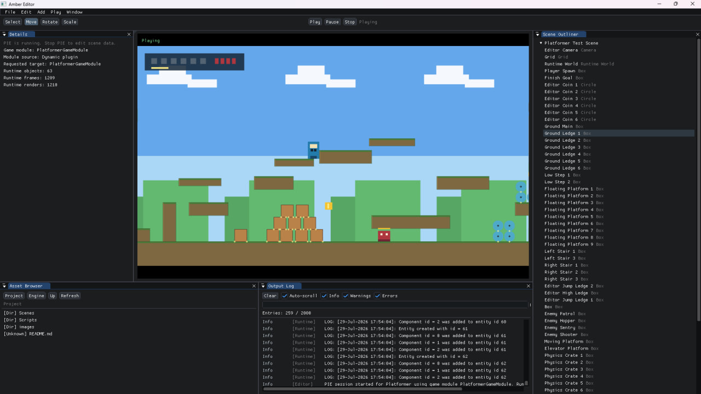

# AmberEngine



AmberEngine is a work-in-progress 2D C++ game engine built around SDL2, ImGui, a custom 2D physics runtime, CMake/Visual Studio workflows and a growing editor/runtime pipeline.

The current direction is engine-style project authoring: `.amberproject` files point to a startup scene, `AmberEditor` edits that scene, PIE runs a duplicated runtime world, and standalone launchers load the same project/scene data through `RuntimePlayer`.

## Current State

- Runtime modules are split under `Engine/Runtime`: core math/project/scene services, ECS, game module interfaces, SDL runtime player/viewer, asset resolution, texture caching and physics.
- `RuntimeWorld` / `BuildRuntimeWorld` is the shared bootstrap path for standalone `RuntimePlayer` and editor PIE. It creates the runtime `Registry`, registers render systems, creates scene objects and exposes the object factory/object list to game modules.
- `RuntimeSceneRendererSDL` can render scene-authored runtime ECS sprite/shape objects with document fallback, shared texture cache and explicit camera policy.
- `AmberEditor` has an ImGui layout with Scene View, Asset Browser, Scene Outliner, Details, Output Log and Play/Stop flow.
- `Projects/Platformer` is the main in-repo game project and current WYSIWYG/PIE test project.
- Unit tests cover physics, runtime logging, asset resolution, runtime renderer config, runtime world bootstrap and editor/runtime parity.
- Formatting is standardized through `.clang-format` and `Format-Code.bat`.

## Repository Layout

```text
Engine/
  Runtime/
    Core/                Build config, math, threading, project and scene services
    Game/                Game module ABI, RuntimePlayer, RuntimeViewerSDL, RuntimeWorld
    Physics/             Custom 2D physics implementation
    EntityComponentSystem/
    Components/ Systems/
    Assets/ Scene/ Logging/
  Editor/                AmberEditor shell, editor services, diagnostics and OutputLog
  ThirdParty/            Bundled headers/sources such as glm, imgui, lua and sol
  Content/               Reserved engine content
Projects/
  Platformer/            Main in-repo project with .amberproject, source and content
  MyGame/                Generated-style starter project
Samples/
  GamesDemos/            GameEngineApp and Platformer2App
  PhysicsDemos/          PhysicsLab, ContainerSandbox and legacy physics demos
Tests/                   GoogleTest targets
Content/                 Legacy sample content used by GameEngineApp
Dependencies/            Local dependency checkouts; vcpkg itself is ignored
Tools/
  Setup/                 Setup/build/clean scripts
  Format/                clang-format helper script
CMakePresets.json        Root CMake presets
Setup.bat                Main Windows setup/build entrypoint
Format-Code.bat          clang-format entrypoint
```

## Requirements

- Windows 10/11.
- Visual Studio 2022 with the Desktop development with C++ workload.
- CMake 3.16 or newer.
- PowerShell 5 or PowerShell 7.
- Git.
- vcpkg through either `Dependencies/vcpkg` or `VCPKG_ROOT`.
- LLVM/clang-format for formatting.

Install LLVM on Windows:

```powershell
winget install --id LLVM.LLVM -e --source winget
```

`Format-Code.bat` finds `clang-format` through `PATH`, a standard LLVM install under `C:\Program Files\LLVM`, or an explicit `-ClangFormatPath`.

Runtime dependencies are declared in `vcpkg.json`: SDL2, SDL2_image, SDL2_mixer, SDL2_ttf, SDL2_gfx, Lua 5.4.8 and GoogleTest.

## Quick Start

Bootstrap dependencies only:

```powershell
.\Setup.bat -DepsOnly
```

Build the default editor-enabled sample set:

```powershell
.\Setup.bat
```

Build the editor:

```powershell
.\Setup.bat -Target Editor
```

Build and run tests:

```powershell
.\Setup.bat -Target Tests
```

For automation, disable the `.bat` pause:

```powershell
$env:AMBER_BUILD_NO_PAUSE = "1"
.\Setup.bat -Target Tests
```

The default generated solution is:

```text
Builds/Editor/AmberEngine.sln
```

## Build Commands

Root editor-enabled configure/build/test:

```powershell
cmake --preset full-local-vcpkg
cmake --build --preset samples-local
cmake --build --preset unit-tests-local
ctest --preset unit-tests-local
```

No-editor/shipping-like configure/build/test:

```powershell
cmake --preset full-local-vcpkg-no-editor
cmake --build --preset samples-local-no-editor
cmake --build --preset unit-tests-local-no-editor
ctest --preset unit-tests-local-no-editor
```

Core physics-only build without SDL/Lua:

```powershell
cmake --preset core
cmake --build --preset core-physics
.\Builds\Core\Engine\Runtime\Physics\Debug\PhysicsCollisionFilteringCheck.exe
```

Project-local Platformer build:

```powershell
cd .\Projects\Platformer
cmake --preset editor
cmake --build --preset editor
```

Useful `Setup.bat` targets:

```powershell
.\Setup.bat -Target Samples
.\Setup.bat -Target Editor
.\Setup.bat -Target Tests
.\Setup.bat -Target Platformer
.\Setup.bat -Target Samples -RunSmoke
.\Setup.bat -Mode NoEditor -Target Samples
.\Setup.bat -Mode Core -Target Core
```

## Formatting

The root `.clang-format` is the project style source of truth. It currently uses C++17, 4-space indentation, Allman braces, `ColumnLimit: 120`, left pointer alignment and no automatic include sorting.

Preview the file set:

```powershell
.\Format-Code.bat -List
```

Check formatting without editing files:

```powershell
.\Format-Code.bat -Check
```

Apply formatting:

```powershell
.\Format-Code.bat
```

Format a smaller area:

```powershell
.\Format-Code.bat -Roots Engine\Runtime\Game
.\Format-Code.bat -Check -Roots Tests
```

By default the formatter scans `Engine`, `Samples`, `Projects` and `Tests`, and skips generated output, dependencies, content folders and bundled third-party code. Use `-IncludeThirdParty` only for deliberate vendor formatting work. A full-project format will create a large diff, so keep it as a separate formatting-only change.

## Running AmberEditor

Build:

```powershell
.\Setup.bat -Target Editor
```

Run:

```powershell
.\Builds\Editor\Engine\Editor\Debug\AmberEditor.exe
```

Open the Platformer project directly:

```powershell
.\Builds\Editor\Engine\Editor\Debug\AmberEditor.exe .\Projects\Platformer\Platformer.amberproject
.\Builds\Editor\Engine\Editor\Debug\AmberEditor.exe --project .\Projects\Platformer\Platformer.amberproject
```

Register `.amberproject` files for the current Windows user:

```powershell
.\Setup.bat -RegisterProjectFiles
```

Editor status:

- Scene View renders the runtime scene preview in edit mode and runtime/game output in Play mode.
- Play mode runs through `EditorPlaySession`, a duplicated runtime scene document and shared `RuntimeWorld`.
- Edit preview keeps the editor camera/pan/zoom; runtime player and Play output use the scene camera policy.
- Dynamic plugin scene-object ABI is still being hardened, so some plugin-owned object registration remains guarded while that boundary stabilizes.

## Running Projects And Samples

After a root editor build:

```powershell
.\Builds\Editor\Projects\Platformer\Debug\PlatformerApp.exe --project .\Projects\Platformer\Platformer.amberproject
.\Builds\Editor\Samples\Debug\GameEngineApp.exe
.\Builds\Editor\Samples\Debug\PhysicsLabApp.exe
.\Builds\Editor\Samples\Debug\ContainerSandboxApp.exe
.\Builds\Editor\Samples\Debug\Platformer2App.exe
```

After a project-local Platformer build:

```powershell
.\Projects\Platformer\Builds\Editor\Debug\PlatformerApp.exe --project .\Projects\Platformer\Platformer.amberproject
```

Fullscreen controls:

- `F11` toggles fullscreen.
- `Alt+Enter` toggles fullscreen.
- `GameEngineApp.exe --fullscreen` starts in fullscreen desktop mode.
- `GameEngineApp.exe --windowed` starts windowed.

## Smoke Checks

Editor smoke:

```powershell
$env:SDL_VIDEODRIVER = "dummy"
.\Builds\Editor\Engine\Editor\Debug\AmberEditor.exe --smoke-test --project .\Projects\Platformer\Platformer.amberproject
```

Platformer runtime smoke:

```powershell
$env:SDL_VIDEODRIVER = "dummy"
.\Builds\Editor\Projects\Platformer\Debug\PlatformerApp.exe --project .\Projects\Platformer\Platformer.amberproject --smoke-test --frames 2
```

Platformer gameplay smoke:

```powershell
.\Projects\Platformer\Builds\Editor\Debug\PlatformerApp.exe --gameplay-smoke-test
```

Other sample smoke checks:

```powershell
.\Builds\Editor\Samples\Debug\PhysicsLabApp.exe --smoke-test
.\Builds\Editor\Samples\Debug\PhysicsLabApp.exe --ui-smoke-test
.\Builds\Editor\Samples\Debug\PhysicsLabApp.exe --perf-test
.\Builds\Editor\Samples\Debug\ContainerSandboxApp.exe --smoke-test
.\Builds\Editor\Samples\Debug\GameEngineApp.exe --smoke-test --level 1
```

## Tests

Targets:

- `PhysicsUnitTests`: math and physics behavior.
- `EngineUnitTests`: logging, asset resolution, runtime renderer config and runtime world bootstrap.
- `EditorUnitTests`: editor/runtime parity when editor targets are available.

Run editor-enabled tests:

```powershell
cmake --build --preset unit-tests-local
ctest --preset unit-tests-local
```

Run no-editor tests:

```powershell
cmake --build --preset unit-tests-local-no-editor
ctest --preset unit-tests-local-no-editor
```

Current next testing direction:

- Expand math coverage for vectors, matrices, transforms, angle conversion, interpolation, normalization edge cases, near-zero behavior, AABB helpers and screen/world coordinate conversion.
- Add more scene serialization, object factory, ECS registry/system, physics edge-case and WYSIWYG parity tests.
- Move smoke-style executable checks into CTest once the lower-level test coverage is stable.

## Runtime And Editor Pipeline

Project flow:

```text
.amberproject
  -> ProjectDescriptor
  -> startupScene
  -> Scene::LoadScene
  -> RuntimeWorld / BuildRuntimeWorld
  -> Registry + scene objects + runtime render systems
  -> RuntimePlayer standalone or EditorPlaySession PIE
  -> RuntimeViewerSDL / RuntimeSceneRendererSDL
```

The intended engine rule is simple: if a scene object is visible and supported by runtime rules, standalone runtime and editor Play should load it through the same path. Editor-only overlays, selection outlines, gizmos and viewport controls sit on top of that runtime frame instead of replacing it.

## Build Flags

AmberEngine uses compile gates through `Core/BuildConfig.h`:

```cpp
#include "Core/BuildConfig.h"

#if WITH_EDITOR
// Editor modules/tools/widgets.
#endif

#if WITH_EDITOR_ONLY_DATA
// Runtime metadata that can be stripped from shipping builds.
#endif

#if SMOKE_TEST
// Smoke-test-only executable paths.
#endif

#if C_UNIT_TEST
// GoogleTest-only code.
#endif
```

`WITH_EDITOR` controls editor code/modules. `WITH_EDITOR_ONLY_DATA` controls runtime metadata useful to editor builds. `SMOKE_TEST` enables executable smoke modes. `C_UNIT_TEST` is enabled by GoogleTest targets. All four macros default to `0` when a target does not define them.

## Git Hygiene

Do not commit generated files or local dependency checkouts:

- `Builds/`
- `build/`, `Debug/`, `Release/`, `.vs/`
- `Dependencies/vcpkg/`
- `vcpkg_installed/`
- `imgui.ini`
- logs and compiler outputs

Before publishing or committing, clean generated local state when needed:

```powershell
.\Setup.bat -Clean -RemoveVcpkg
```

Line endings and binary asset handling are declared in `.gitattributes`.

Working notes such as `ENGINE_ROADMAP.md`, `BUILDING.md` and `REFACTORING.md` are currently ignored by Git in this workspace. Treat them as local planning notes unless the repository policy changes.

## Acknowledgements

This project started from SDL/game-programming learning work inspired by Gustavo Pezzi's educational material and has since been reorganized into the AmberEngine runtime/editor/sample structure.
